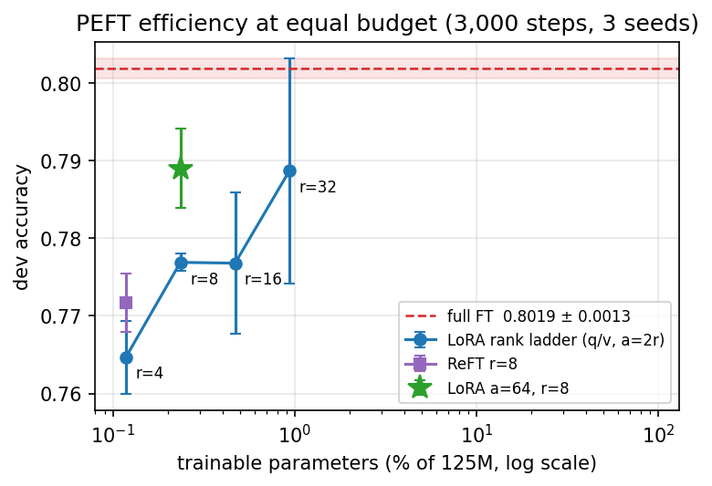
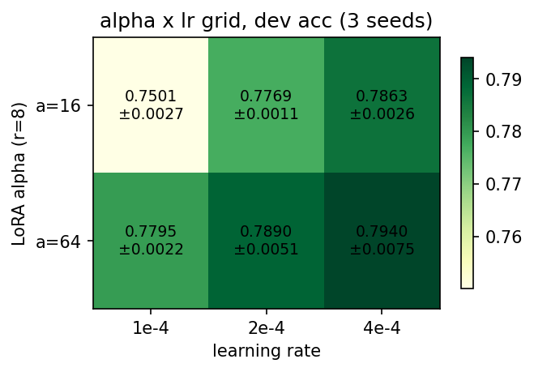
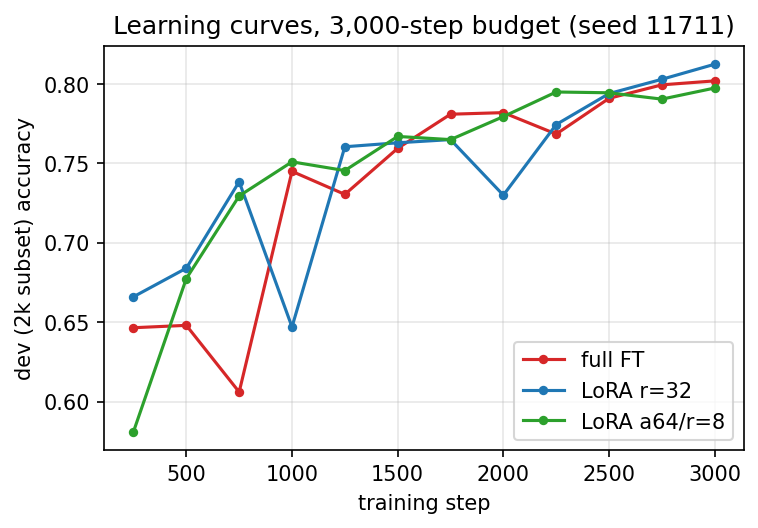
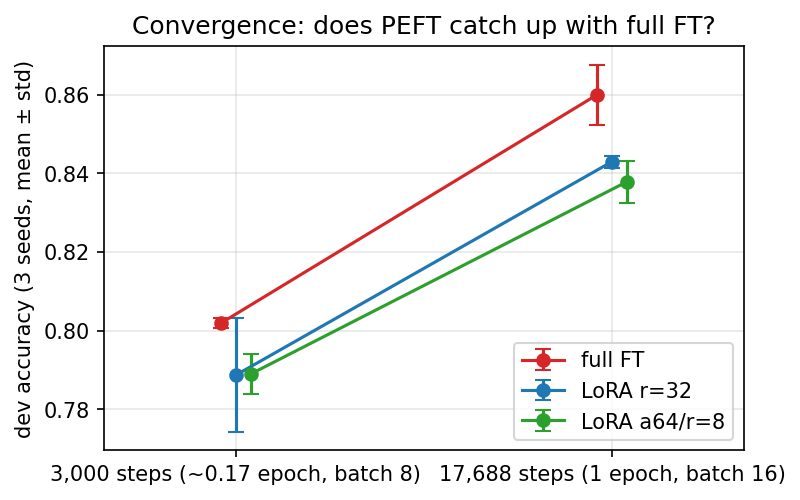
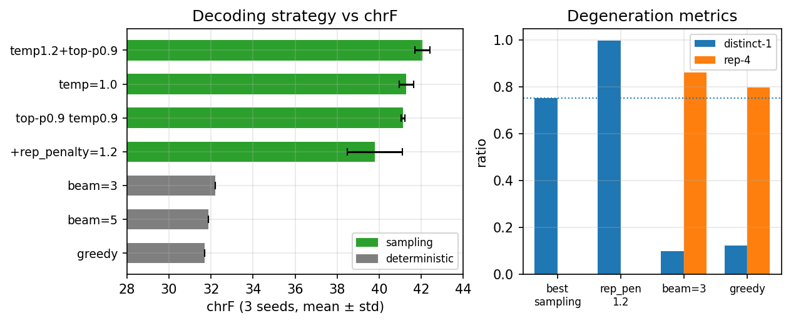

# GPT-2 바닥부터 구축하기: Cloze 기반 Paraphrase Detection의 파라미터 효율적 미세조정(LoRA·ReFT)과 Sonnet 생성 디코딩 전략의 정량 분석

**주제 구분: 지정 주제 프로젝트 (GPT-2 구축하기)**

**팀원**
- 최연식 (chldustlr559@gmail.com)

**GitHub Repository**: https://github.com/yeonsik-choi/NLP_GPT2

---

## 초록 (Abstract)

본 프로젝트는 OpenAI GPT-2(117M)를 PyTorch로 바닥부터 구축하고, 이를 세 가지 후속 태스크 — 감정 분석(SST/CFIMDB), Paraphrase Detection(Quora), Sonnet 생성(Shakespeare) — 에 적용·확장한다. PART-I에서는 멀티헤드 인과 자기어텐션, pre-LayerNorm 트랜스포머 블록, 가중치 공유(weight tying) 출력층, AdamW 옵티마이저의 누락 부분을 직접 구현하여 HuggingFace 공식 가중치를 로드하고 `sanity_check.py`(`atol=1e-1`)를 통과시켰다. PART-II의 핵심 확장 태스크로 **Paraphrase Detection**을 선택하였으며, (1) 이진 분류 헤드 대신 **Cloze 방식**으로 GPT-2가 "yes"/"no" 토큰을 직접 생성하도록 재구성하여 1-epoch 학습에서 dev 정확도 **86.4%**의 기준 모델을 확보하고, (2) **LoRA**(Low-Rank Adaptation) [Hu et al., 2021]를 주입 대상 모듈·rank를 바꿔가며 ablation하고 **ReFT**(LoReFT) [Wu et al., 2024]와 비교하였다. 공정 비교를 위한 **동일 step(3,000) 학습**에서 LoRA r=32(query/value)는 전체의 **0.94%** 파라미터·**약 2.2배 빠른 속도**로 full fine-tuning에 필적하는 정확도를 보였다. 다만 이를 **3개 시드로 재검증**한 결과, r32의 단일-시드 80.1%는 r32 분포의 **최량 시드** 값이었고 평균은 **78.9%±1.5**로 full fine-tuning(**80.2%±0.1**)에 평균 약 1.3%p 못 미치며 시드 분산이 크다(full FT가 2/3 시드에서 우세). 즉 PEFT의 실질 가치는 *정확도 동급*보다 *효율*에 있다. 반대로 보고서가 노이즈로 추정만 했던 **mid-rank(r8 vs r16) 차이는 다중 시드로 노이즈임이 확인**되었고(Δ≈0), rank 사다리는 양극단(r4→r32)에서 +2.4%p로 향상되나 중간 구간은 평탄하다. 나아가 α(scaling) sweep에서 **α=64/r=8이 0.235% 파라미터로 r=32(0.935%)와 동급 정확도**에 도달해, rank로 귀속됐던 이점의 상당 부분이 더 값싼 **유효 업데이트 크기(α/r)** 효과임을 규명했다(dropout은 이 짧은 예산에서 무익). 후속 **α×lr 2D sweep**은 α와 lr이 곱(유효 업데이트)으로 환원되지 않는 **별개 축**임을 보였고(iso-product 비교 Δ=−0.68%p, 견고), 격자 최고 α=64/lr=4e-4(**79.4%**)는 r=32를 1/4 파라미터로 추월했다. 또한 **예제 단위 McNemar 검정**(dev n≈40K)으로 r32 최량 시드조차 full FT와 유의차가 없음(p=0.54)을 확증하는 한편, 시드 단위로는 노이즈인 r8 vs r16이 예제 단위로는 유의해 보이는 **'단일-시드 유의성의 함정'** 을 방법론적 발견으로 보고한다. 마지막으로 세 핵심 설정을 **1 epoch 완주 × 3시드**로 수렴 비교한 결과, full FT(**86.0%±0.8**)가 LoRA r32(84.3%±0.2)·α64/r8(83.8%±0.5)을 전 시드에서 앞서 **"PEFT는 충분히 학습하면 따라잡는다"는 가설이 이 예산에서 성립하지 않음**을 보였고, 동일-step에서 r32와 동급이던 α64/r8이 수렴에서는 뒤져 **α/r 효과가 초기 적응 가속에 국한**됨을, 그리고 과소적합 영역의 '용량↑→분산↑' 경향이 수렴에서는 **역전**(r32 std 0.0015 vs full 0.0077)됨을 규명했다. LoRA의 저비용을 활용해 학습을 늘린 설정(all-modules r16, 8,000 step)은 full fine-tuning의 동일-step 결과를 추월하는 듯했으나(81.9%), **3-시드 재검증에서 평균 80.6%±1.3으로 노이즈 내 동급**으로 강등됐다 — 단일 시드 함정의 네 번째 사례(추월은 최량 시드 효과). 반면 §4.4의 "LoRA r16, 1 epoch에 1.1%p 근접"은 3-시드(84.9%±0.3 vs 86.0%)에서 격차가 정확히 유지되며 **견고하게 확증**됐다. 또한 단일 8GB 환경에서 full fine-tuning(batch 16)이 RAM spill로 약 20배 느려지는 현상을 관측했는데, 후속 혼합정밀 측정으로 그 본질적 메모리 요구는 **~3.9GB에 불과**(즉 spill은 GPU 사전 점유 문제)함을 규명하고, **bf16 혼합정밀이 정확도 손실 없이 학습을 최대 +53% 가속**함을 실측했다. LoRA/ReFT는 옵티마이저 상태가 작아 PEFT의 메모리 우위를 가진다. 부가 기여로 Sonnet 생성에서는 재학습 없이 디코딩 전략만으로 chrF를 greedy에서 nucleus 샘플링으로 향상시켰으며, 이를 **3개 시드로 검증**해 최적 설정(temp1.2+top-p0.9)이 평균 **42.1±0.4**로 greedy(31.7) 대비 **+10.4**가 견고함을 보였다. 또한 **beam search(최대 32.2)는 greedy를 거의 넘지 못하고 샘플링에 약 10점 뒤져** "우도 최대화 ≠ 생성 품질"을 확인했고, repetition penalty는 평균적으로도 chrF를 떨어뜨리는 **음성 결과**(다만 단일 시드 38.0은 최악 시드로 분산이 큼)임을 보고한다. 퇴화 지표(distinct-n·rep-4) 측정으로 이 격차의 메커니즘 — beam·greedy의 반복 퇴화(4-gram의 80~86%가 반복)와 rep_penalty의 과교정(distinct-1 0.998) — 을 정량 입증했다. 모든 학습·튜닝·평가는 train/dev만 사용하였으며 공식 test 데이터는 사용하지 않았다.

---

## 1. 서론 (Introduction)

### 1.1 연구 배경
GPT-2는 "대규모 비지도 사전학습 후 후속 태스크 미세조정" 패러다임을 정착시킨 디코더 전용 언어 모델이다 [Radford et al., 2019]. 모델을 라이브러리로 호출하는 것과 내부를 직접 구현하는 것 사이에는 큰 이해의 격차가 있다. 본 프로젝트는 어텐션·트랜스포머 블록·옵티마이저를 직접 구현해 이 격차를 메우고, 동일한 사전학습 가중치가 분류(감정·의역 판별)와 생성(시 창작)이라는 이질적 태스크에 어떻게 전이되는지를 실증적으로 탐구한다.

### 1.2 기존 접근의 한계
- **Full fine-tuning의 비용**: 후속 태스크마다 1억 2,400만 개 파라미터 전체를 갱신하면 옵티마이저 상태(1·2차 모멘트)까지 포함해 메모리·연산 부담이 크다. 본 연구는 8GB GPU에서 full fine-tuning(batch 16)의 메모리 footprint와 RAM spill의 발생 조건을 정량 분석하고(§4.7–4.7.1), 혼합정밀로 이를 완화한다.
- **분류 헤드와 사전학습의 불일치**: 무작위 초기화한 2-class 선형 헤드는 GPT-2가 사전학습으로 획득한 어휘 분포 지식을 활용하지 못한다.
- **PEFT 설계 선택의 불투명성**: LoRA를 "어디에(주입 모듈), 얼마나(rank)" 적용해야 하는지, 그리고 ReFT 같은 대안과 어떻게 다른지는 소규모 학습 예산에서 충분히 비교되지 않는다.
- **생성 품질의 디코딩 의존성 간과**: 평가지표(chrF)에 대한 디코딩 하이퍼파라미터의 영향은 정량 검증되지 않는 경우가 많다.

### 1.3 본 연구의 기여
1. **Cloze 재구성**으로 Paraphrase Detection을 "yes"/"no" 토큰 생성 문제로 바꾸고, 가중치 공유 출력층으로 사전학습 지식을 활용한다(1-epoch dev 86.4%).
2. **LoRA의 모듈·rank ablation과 ReFT 비교**를 동일 step(3,000)에서 수행하고, 핵심 주장은 **3-시드로 유의성을 검증**하여 ① rank 확대(r4→r32, 견고)가 모듈 확대(노이즈성)보다 크고 견고한 향상을 주며 mid-rank·"key 추가 하락"은 노이즈임을 확증하고 ② LoRA r=32의 "full FT 동급"은 *최량 시드* 효과로 평균은 1.3%p 열위·고분산임을 규명하며 ③ ReFT가 절반 파라미터로 LoRA r8에 일관되게 근접함을 정량화하고 ④ α(scaling) sweep으로 α=64/r=8이 r=32와 동급 정확도를 1/4 파라미터로 냄을 보여 rank 이점의 상당 부분이 유효 업데이트 크기(α/r) 효과임을 규명하며(dropout은 무익) ⑤ α×lr 2D sweep으로 α와 lr이 곱으로 환원되지 않는 별개 축임을 보이고(격자 최고 79.4%가 r32를 1/4 파라미터로 추월) ⑥ 예제 단위 McNemar 검정으로 시드 단위·예제 단위 유의성이 서로 다른 질문임("단일-시드 유의성의 함정")을 방법론적으로 정리하며 ⑦ 1 epoch 완주 3-시드 수렴 비교로 PEFT 열위(1.7%p)가 수렴에서도 유지되고, α/r 효과는 초기 적응 가속에 국한되며, '용량↑→분산↑'이 과소적합 영역 한정 현상임을 보인다. 확장 학습 D와 §4.4 r16 헤드라인도 3-시드로 승격해 전자의 "추월"은 최량 시드 효과로 강등, 후자의 "1.1%p 근접"은 견고함을 확인했다(§4.5.7) — 이로써 모든 헤드라인 비교가 다중 시드 검증을 거쳤다.
3. **현실적 제약(8GB VRAM)** 측면에서 full fine-tuning의 RAM spill(약 20배 저하)을 진단해 원인이 GPU 사전 점유임을 규명하고(실제 요구 ~3.9GB), bf16 혼합정밀로 정확도 손실 없이 +53% 가속함과 PEFT의 메모리 우위를 실측으로 보인다.
4. **디코딩 전략의 chrF ablation**(3-시드 + beam search)에서 샘플링이 greedy 대비 +10.4(견고)를 주는 반면 결정론적 beam search는 샘플링에 약 10점 뒤지며("우도 최대화 ≠ 품질"), repetition penalty는 셰익스피어 텍스트에서 오히려 해로운 음성 결과임을 보고하고, 퇴화 지표(distinct-n·rep-4)로 그 메커니즘(beam의 반복 퇴화, rep_penalty의 과교정)을 정량 입증한다.

### 1.4 보고서의 구성
2장 관련 연구, 3장 GPT-2 구현과 확장(Cloze·LoRA·ReFT·디코딩)의 방법론, 4장 데이터·평가·실험 설정과 정량 결과(기준 모델 비교 포함), 5장 결론·향후 연구로 구성한다.

---

## 2. 관련 연구 (Related Works)

- **GPT-1/GPT-2** [Radford, 2018; Radford et al., 2019]: 단방향 트랜스포머 디코더의 비지도 사전학습이 후속 태스크로 전이됨을 보였다. 본 연구는 사전학습 가중치를 로드해 전이하되, **분류를 생성 형식(Cloze)으로 재구성**한다는 점에서 표준 헤드 부착 방식과 차별된다.
- **Paraphrase Detection** [Fernando & Stevenson, 2008]: 전통적 의미 유사도 접근을 본 연구는 언어모델의 다음 토큰 예측 분포로 환원한다.
- **LoRA** [Hu et al., 2021]: 가중치를 동결하고 저랭크 행렬만 학습하는 PEFT. 원 논문은 대규모 벤치마크에서 효과를 보였으나, 본 연구는 **주입 모듈·rank를 바꾼 ablation**을 소규모·동일-step 조건에서 수행해 설계 선택의 효과를 분리한다.
- **ReFT(LoReFT)** [Wu et al., 2024]: 가중치가 아닌 **은닉 표현의 저차원 직교 부분공간**에 개입하는 PEFT. 본 연구는 ReFT를 직접 구현하여 LoRA와 동일 조건에서 파라미터 효율·속도·정확도를 직접 비교한다(단순 언급에 그친 기존 과제 보고와 차별).
- **Repetition penalty / CTRL** [Keskar et al., 2019]: 이미 생성된 토큰의 logit을 감쇠해 반복을 억제하는 디코딩 기법. 본 연구는 이것이 chrF에 미치는 영향을 셰익스피어 도메인에서 검증한다.
- **Neural text degeneration / nucleus 샘플링** [Holtzman et al., 2020]: 우도를 최대화하는 결정론적 디코딩(greedy·beam search)이 반복적·퇴화 텍스트를 낳고, top-p(nucleus) 샘플링이 더 인간다운 생성을 준다는 발견. 본 연구는 beam search vs 샘플링의 chrF 격차(§4.6.1)로 이 현상을 소네트 도메인에서 정량 재현한다.
- **chrF** [Popović, 2015]: 문자 n-gram F-score. 어휘·형태 다양성에 민감하며, 본 연구는 이 특성이 디코딩 전략 선택을 어떻게 좌우하는지 분석한다.

요컨대 본 연구의 차별점은 **단일 8GB GPU·소규모 예산**이라는 현실 제약 아래에서 (i) LoRA 설계 선택의 ablation, (ii) LoRA vs ReFT 직접 비교, (iii) 메모리 제약의 실측, (iv) 디코딩 전략의 chrF ablation을 하나의 일관된 실험 틀에서 정량화한 점이다.

---

## 3. 제안 방법론 (Proposed Approach)

> **코드 출처 명시**: `models/`, `modules/`, `optimizer.py`, `classifier.py`, `paraphrase_detection.py`, `sonnet_generation.py`의 골격(stub)과 데이터 파이프라인은 과제 제공 starter code이다. §3.1의 누락 코드 블록, §3.2의 Cloze forward, §3.3의 `lora.py`, §3.4의 `reft.py`, §3.5의 `generate()` 확장 및 `generate_beam()`(beam search), 그리고 실험 드라이버 `lora_experiments.py`·`multiseed_experiments.py`·`module_multiseed.py`·`lora_hparam_sweep.py`·`alpha_lr_sweep.py`·`stat_analysis.py`·`learning_curve.py`·`multiepoch_experiment.py`·`d8000_multiseed.py`·`amp_experiment.py`·`sonnet_decode_experiment.py`·`sonnet_decode_multiseed.py`·`degeneration_metrics.py`는 **본인이 직접 작성**하였다. LoRA는 Hu et al.(2021), ReFT는 Wu et al.(2024), repetition penalty는 Keskar et al.(2019), 디코딩 퇴화·nucleus 샘플링은 Holtzman et al.(2020), chrF는 Popović(2015)를 참조하였다.

### 3.1 PART-I: GPT-2와 AdamW 구현 (기준 모델)

**(a) 인과 자기어텐션** (`modules/attention.py`):
$$
\text{Attention}(Q,K,V)=\text{softmax}\!\left(\frac{QK^\top}{\sqrt{d_k}}+M\right)V,\quad
M_{ij}=\begin{cases}0 & j\le i\\ -\infty & j>i\end{cases}
$$

**(b) pre-LayerNorm 블록** (`modules/gpt2_layer.py`):
$$
h' = h + \text{Drop}(\text{Attn}(\text{LN}_1(h))),\quad
h'' = h' + \text{Drop}(\text{FFN}(\text{LN}_2(h')))
$$

**(c) 임베딩·가중치 공유 출력층** (`models/gpt2.py`): $\text{logits}=h_{\text{final}}\,W_{\text{emb}}^\top$.

**(d) AdamW** (`optimizer.py`): 1·2차 모멘트, 편향 보정, decoupled weight decay.
$$
\hat m_t=\tfrac{m_t}{1-\beta_1^t},\;\hat v_t=\tfrac{v_t}{1-\beta_2^t},\;
\theta_t=\theta_{t-1}-\alpha\!\left(\tfrac{\hat m_t}{\sqrt{\hat v_t}+\epsilon}+\lambda\theta_{t-1}\right)
$$

**(e) 감정 분류기** (`classifier.py`): 마지막 비-패딩 토큰 hidden state에 dropout+선형층. `last-linear-layer`/`full-model` 모드 지원.

검증: `sanity_check.py`가 HuggingFace GPT-2 출력과 `atol=1e-1` 이내 일치.

### 3.2 PART-II 확장 ①: Cloze 방식 Paraphrase Detection
평가 코드는 마지막 토큰 logit의 argmax를 **"yes"(BPE 8505)/"no"(BPE 3919)** 와 직접 비교한다. 따라서 `forward()`는 무작위 2-class 헤드 대신 **가중치 공유로 전체 vocab logit**을 반환한다(`paraphrase_detection.py`):
```python
last_token = self.gpt(input_ids, attention_mask)['last_token']
logits = self.gpt.hidden_state_to_token(last_token)   # weight tying → [bs, vocab]
```

### 3.3 PART-II 확장 ②: LoRA (configurable PEFT)
$W$를 동결하고 저랭크 보정만 학습한다 [Hu et al., 2021]:
$$
W' = W + \frac{\alpha}{r} BA,\quad A\in\mathbb{R}^{r\times k},\; B\in\mathbb{R}^{d\times r},\; r\ll\min(d,k),\; B=0\ \text{초기화}
$$
직접 작성한 `lora.py`의 `LoRALinear`는 임의 `nn.Linear`를 감싸며, `inject_lora(targets=...)`로 **주입 대상 모듈(query/key/value/attn_out/mlp)과 rank·dropout을 선택**할 수 있다. 구현 중 `from_pretrained`가 일부 층의 `in/out_features` 속성을 stale 상태로 남기는 문제를 발견하여, 차원을 **weight shape에서 직접** 읽도록 수정했다.

### 3.4 PART-II 확장 ③: ReFT (LoReFT) — LoRA 비교군
가중치가 아닌 **은닉 표현 h**에 개입한다 [Wu et al., 2024]. 직접 작성한 `reft.py`는 선택 레이어 출력에 직교 부분공간 개입을 적용한다:
$$
\Phi(h) = h + R^\top\!\left(W h + b - R h\right),\quad R\in\mathbb{R}^{r\times d}\ (\text{직교 행})
$$
$R$의 직교성은 `torch.nn.utils.parametrizations.orthogonal`로 학습 내내 유지하고, 사전학습 가중치는 전부 동결한다.

### 3.5 PART-II 확장 ④: Sonnet 생성과 디코딩
`forward()`는 각 위치의 전체 vocab logit `[bs, seq, vocab]`을 반환(토큰 단위 LM 학습). `generate()`는 temperature·top-k·top-p에 더해 **repetition penalty**(이미 등장한 토큰의 logit 감쇠 [Keskar et al., 2019])를 추가 지원하고, `generate_beam()`은 길이 정규화를 적용한 **결정론적 beam search**를 직접 구현한다(확률적 샘플링과의 비교군). `sonnet_decode_experiment.py`로 11개 설정을 단일 시드로 비교하고, `sonnet_decode_multiseed.py`로 대표 설정을 **3개 시드**로 반복하며 beam search를 함께 비교한다(§4.6.1).

---

## 4. 실험 (Experiments)

### 4.1 데이터
| 데이터셋 | 태스크 | 분할 | 비고 |
|---|---|---|---|
| SST [Socher et al., 2013] | 5-class 감정 | train 8,544 / dev 1,101 / test 2,210 | 단일 문장 영화평 |
| CFIMDB | 2-class 감정 | train 1,701 / dev 245 / test 488 | 다문장 리뷰 |
| Quora | Paraphrase(이진) | train 283,003 / dev 40,429 (제공 분할) | Cloze 재구성 |
| Sonnets | 시 생성 | train 143 / test 12 | Shakespeare 14행시 |

`datasets.py` 파일 입출력에 `encoding='utf-8'`을 명시해 Windows(cp949) 크래시를 방지했다. **윤리 준수**: 모든 학습·튜닝·평가는 train/dev만 사용했고, Sonnet 디코딩의 dev chrF는 공식 test가 아니라 **학습 소네트 중 마지막 14편을 자체 held-out**으로 분리해 측정했다.

### 4.2 평가 방법
- 감정·Paraphrase: **Accuracy**. Sonnet: **chrF**(sacrebleu).

### 4.3 실험 세부 정보
- 하드웨어: 단일 **RTX 4060 Ti (8GB)**, torch 2.5.1+cu121, seed=11711 고정(`cudnn.deterministic=True`).
- 1-epoch 헤드라인(§4.4): batch 16, full FT lr 1e-5 / LoRA lr 2e-4(r8)·3e-4(r16), 1 epoch.
- PEFT ablation(§4.5): 공정 비교 위해 **batch 8, 동일 3,000 step**(≈0.17 epoch), 확장 설정 D만 8,000 step. AdamW, full FT lr 1e-5 / LoRA lr 2e-4 / ReFT lr 2e-4 (확장 설정 D만 lr 3e-4).
- 다중 시드 검증(§4.5.1 rank·§4.5.2 모듈·§4.5.3 α/dropout·§4.5.4 α×lr): 핵심 설정을 **시드 {11711, 42, 1234}** 로 반복(나머지 설정 동일). 시드는 데이터 셔플 순서와 LoRA/ReFT 초기화를 함께 결정한다.
- 통계 검정·학습 곡선(§4.5.5): seed 11711·3,000 step 고정. McNemar는 dev 40,429 전체의 예제별 정오표로, 학습 곡선은 dev 2,000 부분집합을 250 step마다 평가.
- 수렴 비교(§4.5.6): full/r32/α64(r8)를 1 epoch 완주(batch 16, bf16, full lr 1e-5 / LoRA lr 2e-4)×3시드. run별 자식 프로세스 격리 + 메모리 상한(0.80)·gc_threshold·empty_cache로 8GB spill 방지.
- 한계 마감(§4.5.7): D(8,000 step, lr 3e-4, batch 8, fp32)와 §4.4 r16(1 epoch, lr 3e-4, batch 16, fp32)을 같은 3시드로 승격(전자는 §4.5와 동일 프로토콜로 s11711=0.8186 재현 확인).
- 생성 퇴화 지표(§4.6.2): §4.6.1과 동일 체크포인트(10 epoch)로 held-out 14편의 생성문에서 distinct-1/2·rep-4·평균 길이를 측정.
- 혼합정밀 측정(§4.7.1): full FT를 {fp32, bf16} × {batch 8, 16}으로 각 300 step 학습, `torch.autocast(bfloat16)`·peak VRAM은 `torch.cuda.max_memory_*`로 측정.

### 4.4 결과 1 — Paraphrase Detection 헤드라인 (1 epoch, batch 16)
| 설정 | 학습 파라미터 | 비율 | dev acc |
|---|---|---|---|
| Full fine-tuning | ~124.4 M | 100% | **0.864** |
| LoRA r=16, α=32 (query/value) | 589,824 | 0.47% | 0.853 |
| LoRA r=8, α=16 (query/value) | 294,912 | 0.235% | 0.817 |

→ 충분히 학습(1 epoch)하면 LoRA r=16이 full fine-tuning과 **1.1%p 차**(85.3 vs 86.4)로 근접한다. (이 1-epoch 비교는 §4.5.6에서 **3개 시드로 승격**된다 — full FT 86.4%는 3-시드 분포 84.9~86.7%의 대표값으로 확인.)

### 4.5 결과 2 — PEFT ablation (★헤드라인, 동일 3,000 step, batch 8)
| 설정 | 주입/방법 | 학습 파라미터 | 비율 | it/s | dev acc |
|---|---|---|---|---|---|
| **D: LoRA all-modules r=16 (8,000 step)** | Q/K/V+attn_out+MLP | 2,654,208 | 2.079% | 25.9 | **0.8186** |
| **B: LoRA r=32 (q/v)** | query/value | 1,179,648 | 0.935% | 32.9 | **0.8011** |
| A: **full fine-tuning** (참조) | 전체 | 125,030,400 | 100% | 14.7 | 0.8001 |
| A: LoRA r=8 (q/v) | query/value | 294,912 | 0.235% | 32.3 | 0.7784 |
| A: LoRA r=8 (q/k/v+out) | +attn_out | 589,824 | 0.470% | 30.3 | 0.7764 |
| C: **ReFT r=8** | 표현 개입(전층) | 147,552 | 0.118% | 18.5 | 0.7735 |
| A: LoRA r=8 (all-modules) | Q/K/V+out+MLP | 1,327,104 | 1.050% | 26.0 | 0.7720 |
| B: LoRA r=16 (q/v) | query/value | 589,824 | 0.470% | 33.1 | 0.7691 |
| C: ReFT r=4 | 표현 개입(전층) | 73,776 | 0.059% | 23.9 | 0.7684 |
| B: LoRA r=4 (q/v) | query/value | 147,456 | 0.118% | 32.9 | 0.7580 |
| A: LoRA r=8 (q/k/v) | +key | 442,368 | 0.353% | 31.3 | 0.7521 |

**정량적 해석 (단일 시드 11711 — 다중 시드 재검증은 §4.5.1)**
- **LoRA r=32(q/v)가 full fine-tuning과 동급(처럼 보임)**: 동일 3,000 step에서 80.11% vs 80.01%. 단 이는 **단일 시드 결과**이며, §4.5.1의 다중 시드 검증에서 r32의 이 값이 **최량 시드**였고 평균으로는 full FT에 못 미침을 보인다.
- **확장 학습(D)이 full FT를 추월(처럼 보임)**: LoRA는 한 step이 싸므로 8,000 step까지 늘리면 **81.86%**로 full FT의 3,000-step(80.01%)을 넘는다 → "싸게 더 오래 학습"이 PEFT의 실질 이점. (단, 이 "추월"도 **§4.5.7의 3-시드에서 최량 시드 효과로 판명** — 평균 80.6%±1.3으로 노이즈 내 동급.)
- **rank > 모듈 확대**: 모듈 ablation(r=8, q/v→q/k/v→+out→all)에서 정확도는 75.2~77.8%로 **단조 증가하지 않았다**(특히 key 추가가 오히려 하락). 반면 rank 확대(r=4→32, q/v)는 75.8→**80.1%**로 향상. (단, 이 모듈 차원의 비단조성·"key 하락"은 **§4.5.2 다중 시드에서 노이즈로 판명**되며, mid-rank r8 vs r16의 노이즈성은 §4.5.1에서 확증한다.)
- **ReFT의 파라미터 효율**: ReFT r=8(0.118%, 77.35%)은 LoRA q/v r=8(0.235%, 77.84%)에 **절반 파라미터로 근접**한다. 다만 직교 parametrization 오버헤드로 속도는 더 느리다(18.5 vs 32 it/s).

> 주의: §4.4(1 epoch)와 §4.5(3,000 step)는 학습량·batch가 달라 절대 수치를 직접 비교할 수 없다. §4.5는 **설계 선택을 분리하기 위한 동일-step·동일-batch** 비교이고, §4.4는 수렴 성능이다.

### 4.5.1 결과 2-bis — 다중 시드 유의성 검증 (★, 3 시드 평균±표준편차)

§4.5의 ablation은 단일 시드(11711)였다. 헤드라인 주장이 시드 노이즈에 의존하는지 가리기 위해, 주장을 좌우하는 6개 설정을 **3개 시드(11711, 42, 1234)** 로 동일 3,000 step·batch 8로 반복 학습하였다(`multiseed_experiments.py`). 동일 시드 집합이므로 설정 간 **paired 비교**가 가능하다.

| 설정 | 비율% | it/s | **mean ± std** | min~max | 시드별 (11711/42/1234) |
|---|---|---|---|---|---|
| full fine-tuning | 100 | 15.3 | **0.8019 ± 0.0013** | 0.8001~0.8031 | 0.8001 / 0.8031 / 0.8026 |
| LoRA r=32 (q/v) | 0.935 | 32.5 | 0.7887 ± **0.0145** | 0.7684~0.8011 | 0.8011 / 0.7966 / 0.7684 |
| LoRA r=8 (q/v) | 0.235 | 32.9 | 0.7769 ± 0.0011 | 0.7761~0.7784 | 0.7784 / 0.7761 / 0.7762 |
| LoRA r=16 (q/v) | 0.470 | 32.8 | 0.7768 ± 0.0091 | 0.7691~0.7896 | 0.7691 / 0.7896 / 0.7717 |
| ReFT r=8 | 0.118 | 18.5 | 0.7717 ± 0.0038 | 0.7664~0.7753 | 0.7735 / 0.7664 / 0.7753 |
| LoRA r=4 (q/v) | 0.118 | 33.0 | 0.7647 ± 0.0047 | 0.7580~0.7684 | 0.7580 / 0.7684 / 0.7677 |

**Paired 검정 (동일 시드 집합, Δ = 평균차 ± 차이의 표준편차)**

| 주장 | 비교 | Δ(mean) | 승패 | 판정 |
|---|---|---|---|---|
| ① r32 ≈ full FT? | r32 − full | −0.0133 ± 0.0152 | full **2/3 승** | r32는 *최량 시드*에서만 도달, 평균 1.3%p 열위 |
| ② rank 효과 | r32 − r4 | +0.0239 ± 0.0176 | r32 **3/3 승** | rank 확대 양극단에서 유효 |
| ② mid-rank | r16 − r8 | −0.0001 ± 0.0098 | 1/3 (분할) | **노이즈 확인** |
| ③ ReFT 근접 | r8 − reft | +0.0052 ± 0.0036 | r8 **3/3 승** | ReFT 절반 파라미터로 일관되게 0.5%p 근접 |

**정량적 해석 (다중 시드)**
- **주장 수정 — r32는 full FT와 "동급"이 아니다**: 단일 시드의 80.1%는 r32 분포의 **최댓값**(min 76.84%)이었다. 3-시드 평균은 r32 **78.9%±1.5** vs full FT **80.2%±0.1** 로, full FT가 평균 1.3%p 높고 **2/3 시드에서 우세**하다. 즉 r32가 full FT에 *도달할 수 있으나* 그것은 시드 운에 의존하며, **PEFT의 실질 이점은 정확도 동급이 아니라 99% 적은 파라미터·2배 속도라는 효율**임을 다중 시드가 분명히 한다.
- **주장 확증 — mid-rank 차이는 노이즈**: r8 vs r16은 평균 0.7769 vs 0.7768(Δ≈0, 시드별 승패 분할)로, §4.5에서 추정만 했던 "run-to-run 노이즈"가 **증거로 확인**된다. 짧은 예산에서 r8↔r16 용량 차이는 정확도에 의미 있는 차이를 주지 않는다.
- **분산이 용량에 비례**: full FT(std 0.0013)·저랭크 LoRA r4/r8(std 0.001~0.005)은 매우 안정적인 반면, 고랭크 LoRA r16/r32(std 0.009~0.015)는 시드 민감도가 크다. 짧은 학습 예산에서 **용량을 키울수록 결과 분산이 커진다**는, 단일 시드로는 보이지 않던 현상이다.
- **ReFT의 견고성**: ReFT r8은 LoRA r8 대비 모든 시드에서 일관되게(3/3) 약 0.5%p 아래지만, **절반 파라미터**(0.118% vs 0.235%)로 그 격차를 유지하므로 파라미터 효율 면의 경쟁력은 다중 시드에서도 유효하다.



*그림 1 — 동일 예산(3,000 step)에서 학습 파라미터 비율 vs dev 정확도(3-시드 mean±std). LoRA rank 사다리(파랑), ReFT(보라), α=64/r=8(★, §4.5.3)을 full FT(빨강 점선±음영)와 비교. r=32의 큰 오차막대(시드 분산)와, α=64/r=8이 1/4 파라미터로 r=32와 동급임이 보인다.*

### 4.5.2 결과 2-ter — 모듈 ablation 다중 시드 검증

§4.5.1이 rank 차원을 다중 시드로 보강했다면, 여기서는 §4.5의 **모듈 차원**(주입 대상)을 같은 3개 시드로 재검증한다. rank·step·batch를 모두 고정(LoRA r=8, α=16, 3,000 step, batch 8)하고 주입 모듈만 누적한다(`module_multiseed.py`).

| 주입 모듈 | 비율% | **mean ± std** | min~max | 시드별 (11711/42/1234) |
|---|---|---|---|---|
| q/v | 0.235 | 0.7769 ± **0.0011** | 0.7761~0.7784 | 0.7784 / 0.7761 / 0.7762 |
| +key (q/k/v) | 0.353 | 0.7673 ± 0.0123 | 0.7521~0.7824 | 0.7521 / 0.7824 / 0.7673 |
| +attn_out | 0.470 | 0.7785 ± 0.0079 | 0.7701~0.7890 | 0.7764 / 0.7890 / 0.7701 |
| all (+mlp) | 1.050 | **0.7872** ± 0.0121 | 0.7720~0.8017 | 0.7720 / 0.7880 / 0.8017 |

**Paired (q/v 기준):** +key Δ=−0.0096±0.0133(1/3승, 노이즈) · +attn_out Δ=+0.0016±0.0082(노이즈) · all Δ=+0.0103±0.0131(2/3승, 경계)

**정량적 해석**
- **주장 수정 — "key 추가가 해롭다"는 단일 시드 함정**: §4.5의 q/k/v=0.7521(q/v보다 낮음)은 q/k/v 분포의 **최악 시드**였다. 다른 시드는 0.7824로 오히려 q/v보다 높아, 3-시드 평균(0.7673±0.0123)은 q/v와 **노이즈 범위에서 겹친다**. 따라서 "key 추가가 정확도를 떨어뜨린다"는 §4.5의 인상은 견고하지 않다.
- **모듈 확대는 완만하게 도움(노이즈성)**: q/v→+attn_out→all로 평균이 상승하며 all-modules가 최고(0.7872, 최대 0.8017)이고 2/3 시드에서 q/v를 이긴다. 다만 표준편차(0.0131)가 평균차(0.0103)와 맞먹어 통계적으로는 경계적이다 — 단일 시드에서 보이던 "비단조성"은 q/k/v의 노이즈 dip 때문이었다.
- **"rank > 모듈" 방향은 유지되되 더 정밀해짐**: rank 확대(r4→r32, +2.4%p, **3/3 견고**, §4.5.1)가 모듈 확대(q/v→all, +1.0%p, 2/3, 노이즈성)보다 **더 크고 견고한** 향상을 준다. 둘 다 용량을 늘리지만 rank 쪽이 신뢰할 수 있는 지렛대다.
- **분산↑ 패턴 재확인**: 가장 제약된 q/v(0.235%)가 std 0.0011로 압도적으로 안정적이고, 모듈을 추가할수록 분산이 커진다(§4.5.1의 rank 관찰과 동일한 경향).

### 4.5.3 결과 2-quater — LoRA α(scaling)·dropout 정밀 sweep

§4.5는 LoRA의 α=2r·dropout=0 관례를 고정했다. 여기서는 rank(r=8)·모듈(q/v)·step(3,000)·batch(8)·lr(2e-4)를 모두 고정하고 **α와 dropout 두 축만 따로** 3개 시드로 sweep한다(`lora_hparam_sweep.py`). LoRA 업데이트는 $(\alpha/r)\,BA$이므로 α는 사실상 LoRA 경로의 유효 학습률(업데이트 크기)을 조절한다.

**(1) α sweep** (r=8, q/v, dropout=0)

| α (스케일링 α/r) | 비율% | mean ± std | 기준(α=16) 대비 |
|---|---|---|---|
| 8 (×1) | 0.235 | 0.7659 ± 0.0025 | Δ −0.0110, **0/3** → 하락 |
| **16 (×2)** 기준 | 0.235 | 0.7769 ± 0.0011 | — |
| 32 (×4) | 0.235 | 0.7854 ± 0.0027 | Δ +0.0085, **3/3** → 개선 |
| 64 (×8) | 0.235 | **0.7890 ± 0.0051** | Δ +0.0121, **3/3** → 개선 |

**(2) dropout sweep** (r=8, q/v, α=16)

| dropout | mean ± std | 기준(0) 대비 |
|---|---|---|
| **0** 기준 | 0.7769 ± 0.0011 | — |
| 0.05 | 0.7757 ± 0.0022 | Δ −0.0012, 노이즈 |
| 0.10 | 0.7747 ± 0.0042 | Δ −0.0022, 노이즈 |
| 0.20 | 0.7727 ± 0.0036 | Δ −0.0042, **0/3** (미세 하락 추세) |

**정량적 해석**
- **α(스케일링)은 키울수록 단조·견고 개선**: α 8→64에서 76.6→**78.9%**로 일관 상승(α=32, 64는 기준 대비 **3/3 시드 우세**). 고정 lr에서 α/r 비율이 클수록 LoRA 경로의 유효 업데이트가 커져 짧은 예산에서 더 빨리 적응한다.
- **🔑 핵심 인사이트 — 고랭크의 이점을 저랭크+높은 α로 1/4 파라미터에 재현**: α=64/r=8은 **0.235%** 파라미터로 78.90%인데, 이는 §4.5.1의 **r=32**(0.935% 파라미터, 스케일링 ×2)의 78.87%와 **사실상 동일**하다. 즉 §4.5.1에서 "rank 확대"로 귀속됐던 향상의 상당 부분은 실은 **유효 업데이트 크기(α/r)** 효과이며, **α는 파라미터를 늘리지 않는 더 값싼 지렛대**다. (다만 α를 더 키우면 학습 불안정 위험이 있어 lr과 함께 조율해야 한다 — α=64에서 분산이 std 0.0051로 가장 크다.)
- **dropout은 이 예산에서 도움이 안 된다**: dropout을 0→0.2로 키울수록 정확도가 미세하게 단조 하락(0.2에서 0/3 시드)하나 대부분 노이즈 범위다. 3,000 step(≈0.17 epoch)은 283K Quora를 거의 한 번도 못 보는 **과소적합 영역**이라 정규화할 과적합이 없고, dropout은 신호만 깎는다. dropout=0이 최선이며, 다중 에폭 학습에서야 의미가 생길 것이다.
- (α를 LoRA 경로의 "유효 학습률"로 본 위 해석이 lr 조절과 **정확히 동치인지**는 §4.5.4의 α×lr 2D sweep에서 분리 검증한다.)

### 4.5.4 결과 2-quinquies — α × lr 2D sweep: α와 lr은 중복인가

§4.5.3은 α를 "LoRA 경로의 유효 학습률"로 해석했다. 그렇다면 α를 키우는 것이 lr를 키우는 것과 동치인가? LoRA 업데이트가 $(\alpha/r)\,B A$이고 학습은 Adam이므로, **유효 업데이트** $\propto (\alpha/r)\cdot\text{lr}$로 단순화되는지 확인한다. r=8·q/v·3,000 step·batch 8을 고정하고 α∈{16,64} × lr∈{1e-4,2e-4,4e-4}를 3개 시드로 sweep했다(`alpha_lr_sweep.py`).

| α \ lr | 1e-4 | 2e-4 | 4e-4 |
|---|---|---|---|
| **α=16** | 0.7501 ± 0.0027 | 0.7769 ± 0.0011 | 0.7863 ± 0.0026 |
| **α=64** | 0.7795 ± 0.0022 | 0.7890 ± 0.0051 | **0.7940 ± 0.0075** |

**Iso-product 비교** (유효 α/r·lr이 같은 두 점, ∝ 8e-4): α=16/lr=4e-4 = **0.7863** vs α=64/lr=1e-4 = **0.7795** → Δ = **−0.0068 ± 0.0006** (α=16 우세, 매우 견고).

**정량적 해석**
- **α와 lr은 곱으로 환원되지 않는 별개 축**: 유효 업데이트가 같아도(8e-4) α=16/lr=4e-4가 α=64/lr=1e-4보다 0.68%p 높다(차의 std 0.0006로 확고). Adam은 그래디언트 크기를 좌표별로 정규화하므로 lr(스텝 크기)과 α(forward 출력·그래디언트 스케일)는 학습 동역학에서 **다르게 작용**한다 — §4.5.3의 "α=유효 lr"은 유용한 직관이나 정확한 동치는 아니다.
- **둘 다 키우는 것이 최선**: 격자 최고는 α=64/lr=4e-4 = **79.40%**로, §4.5.1의 **r=32(0.935%, 78.87%)를 1/4 파라미터(0.235%)로 추월**한다. "저랭크 + α·lr 동시 상향"이 고랭크보다 값싸고 강하다.
- **공격적일수록 분산↑**: 유효 업데이트가 클수록(α=64/lr=4e-4) 시드 분산이 커진다(std 0.0075) — §4.5.1·4.5.2와 동일한 "용량·강도↑ → 분산↑" 경향.



*그림 2 — α×lr 격자의 dev 정확도(3-시드). 대각 방향(우하)으로 단조 상승하나, iso-product 두 칸(α16/lr4e-4 vs α64/lr1e-4)이 다른 값을 가져 α와 lr이 곱으로 환원되지 않음을 보인다.*

### 4.5.5 결과 2-sexies — 예제 단위 McNemar 검정과 학습 곡선

PEFT 비교를 두 분석으로 마무리한다(둘 다 seed 11711, 3,000 step): (A) dev 40,429 예제에 대한 paired **McNemar 검정**, (B) step별 dev 정확도 **학습 곡선**.

**(A) 예제 단위 McNemar** (`stat_analysis.py`) — 시드 단위(§4.5.1, n=3)는 검정력이 약하므로, 동일 시드에서 두 모델의 예제별 정답/오답을 짝지어 검정한다(n≈40K → 강력).

| 비교 (A vs B) | A만 맞음 | B만 맞음 | χ² | p-value | 판정 |
|---|---|---|---|---|---|
| r32 vs full | 1,973 | 1,934 | 0.37 | 0.54 | **유의X (동급)** |
| r16 vs r8 | 3,512 | 3,889 | 19.10 | 1.2e-5 | 유의, r8↑ |
| alpha64 vs r32 | 2,005 | 2,235 | 12.37 | 4.4e-4 | 유의, r32↑ |
| alpha64 vs full | 2,486 | 2,677 | 6.99 | 8.2e-3 | 유의, full↑ |

- **r32 ≈ full을 예제 단위로도 확증**: r32의 *최량 시드*(0.8011)에서조차 full(0.8001)과의 차이가 **통계적으로 유의하지 않다**(p=0.54). 시드 단위(full 2/3 승, §4.5.1)와 합치면 "둘은 정말 막상막하"가 두 스코프에서 견고하다.
- **⚠️ 단일-시드 유의성의 함정 (방법론적 발견)**: r16 vs r8은 예제 단위로는 r8이 **유의하게 우세**(p=1.2e-5)지만 §4.5.1의 시드 단위로는 **노이즈**(Δ≈0, 승패 분할)였다. 한 시드 안에서 통계적으로 유의해도 시드를 바꾸면 사라질 수 있다. 예제 단위 McNemar는 "이 학습된 쌍의 예측 차이가 우연인가", 다중 시드는 "결론이 학습 난수성에 견고한가"를 묻는 **서로 다른 질문**이며, 설계 권고는 두 스코프 모두에서 살아남는 결론에만 근거해야 한다. (alpha64 vs r32/full의 유의성도 r32 최량 시드인 11711에 한정된 것으로, 시드 평균 §4.5.3–4.5.4에서는 경쟁적이다.)

**(B) 학습 곡선** (dev 2,000 부분집합, `learning_curve.py`)

| step | 250 | 500 | 1000 | 1500 | 2000 | 2500 | 3000 |
|---|---|---|---|---|---|---|---|
| full | 0.647 | 0.648 | 0.745 | 0.760 | 0.782 | 0.791 | 0.802 |
| r32 | 0.666 | 0.684 | 0.647 | 0.763 | 0.730 | 0.794 | 0.813 |
| alpha64 | 0.581 | 0.678 | 0.751 | 0.767 | 0.780 | 0.795 | 0.798 |

- 초반(≤750 step)엔 변동이 크지만 LoRA(r32·alpha64)가 full FT보다 빠르게 적정 정확도에 도달하는 경향(step 500: LoRA ~0.68 vs full 0.65)을 보이고, 세 설정 모두 **step ~2,500에서 ~0.80으로 수렴**한다. 곡선은 dev 부분집합·단일 시드라 노이즈가 있어 정량 결론보다 **동역학(LoRA의 빠른 초기 적응, 공통 수렴)** 의 정성 관찰로 본다.



*그림 3 — 3,000-step 예산의 학습 곡선(dev 2k, seed 11711). LoRA 계열의 빠른 초기 적응과 세 설정의 공통 수렴이 보인다.*

### 4.5.6 결과 2-septies — 수렴(1 epoch 완주) 비교: PEFT는 충분히 학습하면 따라잡는가 (★)

§4.5의 동일-step(3,000 ≈ 0.17 epoch) 비교는 과소적합 영역이었다. "PEFT가 충분히 학습하면 full FT를 따라잡는가"를 가리기 위해, full FT / LoRA r=32 / LoRA α=64(r=8)를 **1 epoch 완주**(17,688 step, batch 16, bf16)·3개 시드로 학습해 수렴 정확도를 비교했다(`multiepoch_experiment.py`). §4.4의 단일-시드 1-epoch 헤드라인을 다중 시드로 승격하는 실험이기도 하다.

| 설정 | 비율% | it/s | **mean ± std** | min~max | 시드별 (11711/42/1234) |
|---|---|---|---|---|---|
| full fine-tuning | 100 | 11.3 | **0.8600 ± 0.0077** | 0.8492~0.8665 | 0.8643 / 0.8665 / 0.8492 |
| LoRA r=32 (q/v) | 0.935 | 24.2 | 0.8430 ± **0.0015** | 0.8418~0.8450 | 0.8418 / 0.8420 / 0.8450 |
| LoRA α=64, r=8 (q/v) | 0.235 | 24.2 | 0.8379 ± 0.0053 | 0.8338~0.8454 | 0.8338 / 0.8345 / 0.8454 |

**Paired 검정 (동일 시드 집합):** r32 − full = **−0.0170 ± 0.0091** (full **3/3 승**) · α64 − full = −0.0221 ± 0.0130 (full **3/3 승**) · r32 − α64 = +0.0051 ± 0.0038 (r32 2/3 승)

**정량적 해석**
- **수렴에서도 full FT 우위는 유지된다**: 1 epoch 완주에서 full FT(86.0%)가 r32(84.3%)를 모든 시드에서 1.7%p 앞선다. 동일-step의 1.3%p 열위(§4.5.1)가 수렴에서 좁혀지기는커녕 약간 벌어져, **"PEFT가 충분히 학습하면 따라잡는다"는 가설은 이 데이터·예산에서 성립하지 않는다**. PEFT의 가치는 역시 효율(0.94% 파라미터, 2.1배 속도: 26분 vs 12분/epoch)이다.
- **🔑 분산 역전 — '용량↑→분산↑'은 과소적합 영역 한정**: 3,000 step에서 r32는 고분산(std 0.0145)·full FT는 안정(0.0013)이었는데(§4.5.1), 1 epoch에서는 **정확히 반대**다(r32 std 0.0015 vs full 0.0077). 짧은 예산에서 고랭크의 시드 민감성은 수렴하면서 사라지며, 오히려 full FT 쪽에 시드 편차(s1234 84.9%)가 남는다. §4.5.1–4.5.4에서 일관되게 관찰된 "용량·강도↑ → 분산↑" 경향이 *학습량이 부족한 영역의 현상*임을 규명한다.
- **α/r 효과는 초기 적응 가속에 국한**: 3,000 step에서 r32와 동급이던 α=64/r=8(§4.5.3)이 1 epoch에서는 r32에 평균 0.5%p 뒤진다(2/3 시드, s1234에서만 역전). 유효 업데이트 크기(α/r)는 **빨리 적응하게** 해줄 뿐, 수렴 정확도의 상한은 실제 표현 용량(rank)이 결정한다 — §4.5.5(B) 학습 곡선의 "공통 수렴" 관찰을 수렴 영역까지 연장·정정하는 결과다.
- **§4.4 헤드라인의 대표성 확인**: §4.4의 full FT 86.4%(fp32, seed 11711)는 3-시드 분포(84.9~86.7%, 평균 86.0%) 안의 대표적 값이며, bf16에서 동일 시드가 86.43%로 재현돼 §4.7.1의 "bf16 정확도 무손실"도 전체 epoch 규모에서 재확인됐다. §4.4의 LoRA r=16(85.3%, lr 3e-4)이 본 실험 r=32(84.3%, lr 2e-4)보다 높은 것은 lr 차이(§4.5.4: lr↑ 유리)와 일관된다(§4.5.7의 r16 3-시드 84.9%±0.3으로 확증).



*그림 4 — 동일-step(3,000)과 1 epoch 완주의 dev 정확도(3-시드 mean±std). full FT의 우위가 수렴에서도 유지되고, 3,000 step에서 r32와 동급이던 α64/r8이 수렴에선 뒤지며, 오차막대의 역전(r32: 큼→작음, full: 작음→큼)이 보인다.*

> **실험 노트(메모리 공학)**: 이 실험에서 full FT(batch 16)의 라이브 메모리 피크가 초장문 배치에서 **5.4GB+**까지 튀어(§4.7.1의 300-step 측정 ~3.9GB를 상회), 다른 프로세스가 ~1.2GB를 점유한 8GB GPU에서 §4.7의 RAM spill(~41W 정체)이 재발했다. run별 자식 프로세스 격리에 더해 **per-process 메모리 상한(0.80) + garbage_collection_threshold + 주기적 empty_cache**로 예약을 강제 억제해 spill 없이 완주했다(학습 수치 불변, full FT 11.3 it/s로 §4.7.1의 14.4 대비 소폭 오버헤드).

### 4.5.7 결과 2-octies — 확장 학습(D)·§4.4 헤드라인의 다중 시드 승격 (한계 마감)

§5.2가 단일 시드로 남겨 두었던 마지막 두 설정 — 확장 학습 D(all-modules r16 α32, lr 3e-4, 8,000 step, batch 8)와 §4.4의 LoRA r=16(lr 3e-4, 1 epoch, batch 16) — 을 같은 3개 시드로 승격했다(`d8000_multiseed.py`, `paraphrase_detection.py --seed`).

| 설정 | 비율% | **mean ± std** | 시드별 (11711/42/1234) | 비교 대상 | paired Δ |
|---|---|---|---|---|---|
| D: 확장 학습 (8,000 step) | 2.079 | 0.8057 ± **0.0129** | 0.8186 / 0.7881 / 0.8103 | full FT 3,000-step (0.8019±0.0013) | +0.0037 ± 0.0140 (**2/3승, 노이즈**) |
| §4.4 LoRA r=16 (1 epoch) | 0.470 | **0.8493 ± 0.0033** | 0.853 / 0.850 / 0.845 | full FT 1 epoch (§4.5.6, 0.8600±0.0077) | −0.0107 ± 0.0050 (full **3/3승**) |

**정량적 해석**
- **주장 수정 — D의 "추월"은 네 번째 단일 시드 함정**: §4.5의 81.86%는 D 분포의 **최량 시드**였다. 3-시드 평균(80.6%±1.3)은 full FT 동일-step(80.2%±0.1)과 **노이즈 내 동급**이고, 최악 시드(78.8%)는 오히려 full FT보다 낮다. r32 "동급"(§4.5.1)·"key 하락"(§4.5.2)·rep_penalty 과장(§4.6.1)에 이어, **공격적 설정(all-modules + lr 3e-4)의 고분산**(std 0.0129 — "강도↑→분산↑", §4.5.1–4.5.4)이 또 한 번 단일 시드 주장을 무너뜨렸다. 수정된 결론: "싸게 더 오래"는 full FT 동일-step을 *평균적으로 따라잡는* 수준이며, 추월은 시드 운이다.
- **§4.4 r16의 "1.1%p 근접"은 견고 확증**: 3-시드 평균 84.9%±0.3 vs full FT 86.0%±0.8 — 단일 시드의 격차(85.3 vs 86.4 = 1.1%p)가 평균에서도 **정확히 1.1%p로 유지**되고, r16은 저분산이다. §4.4 헤드라인 결론("1 epoch이면 LoRA r16이 full FT에 1.1%p 근접")은 시드에 견고하다.
- **lr이 rank보다 효과적이라는 §4.5.4 결론의 1-epoch 재현**: r16(0.470%, lr 3e-4)의 84.9%가 r32(0.935%, lr 2e-4)의 84.3%(§4.5.6)보다 높다 — 파라미터 절반으로 0.6%p 우위. 수렴 영역에서도 lr 상향이 rank 상향보다 값싼 지렛대다.
- **부수 관찰(lr 민감성)**: 잘못 설정된 첫 시도에서 D를 lr 2e-4로 학습하자 같은 시드(11711)에서 82.96%(원 lr 3e-4: 81.86%)가 나왔다(`d8000_lr2e4.log`). 8,000-step all-modules 영역에서는 lr 3e-4가 과도해 분산을 키우고 평균을 깎았을 가능성이 있다 — "lr↑ 유리"(§4.5.4, r8/qv·3,000 step)가 설정·예산에 따라 뒤집힐 수 있음을 보이는 단일 관찰이다.

이로써 본 보고서의 **모든 헤드라인 비교(§4.4·§4.5의 전 설정)가 3-시드 검증을 거쳤다**. 견고하게 살아남은 주장(§4.4 r16 근접, rank 사다리 양극단, ReFT 근접, 디코딩 +10.4)과 강등된 주장(r32 동급, key 하락, D 추월, rep_penalty 크기)이 명확히 갈린다.

### 4.6 결과 3 — Sonnet 디코딩 전략 (dev chrF, 높을수록 좋음, 단일 시드 11711)
| 순위 | 전략 | chrF |
|---|---|---|
| 1 | **temperature=1.2 + top-p=0.9** (기본값) | **42.56** |
| 2 | top-p=0.9, temp=0.9 | 41.08 |
| 3 | temperature=1.0 | 40.83 |
| 4 | temperature=0.7 / top-k=40(temp0.9) | 39.98 |
| 6 | top-k=40 + top-p=0.9 | 39.88 |
| 7 | top-p0.9 t1.0 + **rep_penalty=1.2** | 39.06 |
| 8 | best + **rep_penalty=1.3** | 38.82 |
| 9 | top-p=0.9, temp=0.7 | 38.73 |
| 10 | best + **rep_penalty=1.2** | 38.00 |
| 11 | **greedy** | **31.68** |

**정량적 해석**
- **greedy → 최적 샘플링 = +10.9 chrF**를 학습 비용 0으로 달성. 창작 텍스트에서 greedy는 반복·퇴화로 최악.
- **반직관적 발견 1**: temperature를 0.7로 낮추면 오히려 chrF 하락 → chrF가 보상하는 어휘 다양성을 과도하게 보수적인 디코딩이 깎는다.
- **반직관적 발견 2 (음성 결과)**: **repetition penalty가 chrF를 떨어뜨린다**(42.56 → 38.0~39.1). 셰익스피어 소네트는 의도적 반복·대구(parallelism)를 쓰므로, 반복을 억제하면 오히려 원본 분포에서 멀어진다. 일반 텍스트의 통념과 달리 이 도메인에서는 해롭다는 점을 정직하게 보고한다.
- 결론: temperature 1.0~1.2 + nucleus(0.9)가 최적이며, 제공 기본값이 잘 설정되어 있음을 검증.

### 4.6.1 결과 3-bis — 디코딩 다중 시드 검증 + beam search 비교

§4.6은 단일 시드였고 샘플링은 확률적이므로, 대표 설정을 **3개 시드(11711, 42, 1234)** 로 반복해 chrF 평균±표준편차를 측정하고, 결정론적 **beam search**(beam∈{1,3,5}, 길이 정규화)를 추가 비교하였다(`sonnet_decode_multiseed.py`, `SonnetGPT.generate_beam`).

| 전략 | 종류 | **chrF mean ± std** | min~max | 시드별 |
|---|---|---|---|---|
| temp=1.2 + top-p=0.9 (기본값) | 샘플링 | **42.06 ± 0.36** | 41.79~42.56 | 42.56 / 41.81 / 41.79 |
| temp=1.0 | 샘플링 | 41.29 ± 0.34 | 40.83~41.64 | 40.83 / 41.64 / 41.40 |
| top-p=0.9, temp=0.9 | 샘플링 | 41.12 ± 0.09 | 41.03~41.25 | 41.08 / 41.25 / 41.03 |
| best + rep_penalty=1.2 | 샘플링 | 39.79 ± **1.30** | 38.00~41.02 | 38.00 / 40.36 / 41.02 |
| **beam=3** | 결정론적 | 32.19 | — | (시드 무관) |
| beam=5 | 결정론적 | 31.86 | — | (시드 무관) |
| beam=1 (=greedy) | 결정론적 | 31.70 | — | (시드 무관) |

**정량적 해석 (다중 시드 + beam)**
- **greedy→샘플링 +10.4 견고**: 최적 샘플링 평균 42.06 vs greedy 31.70. 최적 설정의 **최저 시드(41.79)** 조차 모든 beam·greedy보다 +9.6 이상 위 → §4.6의 핵심 결론은 시드에 견고하다.
- **beam search의 음성 결과 (신규)**: beam=3은 greedy 대비 +0.5에 그치고 beam=5는 오히려 하락하며, 모든 beam이 샘플링에 **약 10점 뒤진다**. 결정론적 고-우도 탐색은 반복적·저다양성 텍스트를 낳아 chrF가 보상하는 어휘 다양성을 잃는다 — **"우도 최대화 ≠ 생성 품질"** 의 전형적 사례로, 창작 도메인에서 beam search가 부적합함을 실측했다.
- **rep_penalty 음성 결과 — 진짜이나 단일 시드가 과장**: 단일 시드의 38.00은 rep_penalty 분포의 **최악 시드**였고, 3-시드 평균은 39.79±1.30로 best 대비 -2.3(단일 시드로는 -4.6로 과장)이다. 여전히 음성이며 **분산이 가장 크다**(std 1.30) → 반복 억제가 셰익스피어 분포와 충돌함을 다중 시드가 더 정확히 보여준다.
- **기본값의 견고성**: temp1.2+top-p0.9은 평균 최고이자 분산도 작아(0.36), 제공 기본값이 잘 설정되어 있다는 §4.6 결론이 다중 시드로 확인된다.

### 4.6.2 결과 3-ter — 생성 퇴화(degeneration) 정량화: chrF 격차의 메커니즘

§4.6.1은 beam search가 "반복적·저다양성"이라 주장했으나 수치로 보이진 않았다. 각 전략의 생성문에서 어휘 다양성(distinct-n)과 반복(rep-4 = 반복되는 4-gram 비율)을 측정해 chrF 격차의 원인을 직접 입증한다(`degeneration_metrics.py`, dev 14편 평균) [Holtzman et al., 2020].

| 전략 | chrF | distinct-1 | distinct-2 | rep-4 | mean_len |
|---|---|---|---|---|---|
| best: temp1.2+top-p0.9 | 42.1 | 0.754 | 0.945 | **0.000** | 124.4 |
| rep_penalty=1.2 | 39.8 | **0.998** | 1.000 | 0.000 | 85.8 |
| beam=3 | 32.2 | **0.100** | 0.119 | **0.861** | 128.0 |
| greedy | 31.7 | 0.123 | 0.162 | 0.798 | 122.8 |

**정량적 해석**
- **beam·greedy의 퇴화가 수치로 확정**: beam=3은 고유 unigram이 **10%**뿐이고 4-gram의 **86%가 반복**(greedy도 distinct-1 0.123, rep-4 0.80)이다. 같은 구절을 끝없이 되풀이하는 전형적 퇴화로, chrF가 보상하는 어휘 다양성을 잃어 31~32점에 머문다. §4.6.1의 "beam이 샘플링에 ~10점 뒤짐"의 **직접 원인**이다.
- **chrF는 '자연스러운 다양성과의 일치'를 보상**: 최적 샘플링(distinct-1 0.75, rep-4 0)이 원본 소네트의 어휘 다양성에 가장 근접해 최고점을 낸다. 즉 chrF 순위(42.1>39.8>32.2>31.7)는 다양성이 원본 수준에 얼마나 가까운지를 그대로 반영한다.
- **repetition penalty는 '과교정'**: rep_penalty는 distinct-1을 **0.998**(거의 모든 토큰이 유일)까지 끌어올리고 길이를 124→86으로 줄인다. 반복을 너무 강하게 억제해 오히려 원본 분포에서 *반대 방향으로* 멀어지므로, 퇴화는 없지만 chrF가 best보다 낮다(§4.6.1의 음성 결과를 보완 설명). 즉 다양성은 많을수록 좋은 게 아니라 **원본 수준에 맞아야** 한다.



*그림 5 — (좌) 디코딩 전략별 chrF(3-시드 mean±std; 결정론적 전략은 시드 무관). (우) 퇴화 지표: beam·greedy의 낮은 distinct-1·높은 rep-4(반복 퇴화)와 rep_penalty의 distinct-1≈1(과교정). 점선은 최적 샘플링의 distinct-1 수준.*

### 4.7 결과 4 — 현실적 제약: 8GB VRAM과 PEFT의 메모리 우위
실험 중 full fine-tuning을 batch 16으로 돌리자 **GPU 사용률 100%인데 전력은 160W 중 ~40W**로 낮고 학습이 정상 대비 **약 20배 느려지는** 현상을 관측했다. 관측 당시 VRAM은 **7.84/8.19GB가 점유되어 여유가 110MB뿐**이었고, full fine-tuning(batch 16)이 요구하는 메모리가 이 잔여 공간을 넘자 Windows 드라이버가 부족분을 **시스템 RAM으로 spill**한 것이 원인이었다. batch 8로 낮추자 정상 속도(full FT 14.7 it/s)로 복귀했다. 다만 full fine-tuning(batch 16) **자체의 PyTorch 메모리 요구는 약 3.9GB에 불과**함을 후속 측정(§4.7.1)으로 확인했다 — 즉 spill은 full FT가 8GB를 본질적으로 초과해서가 아니라 **관측 시점에 다른 프로세스가 GPU를 이미 점유**하고 있었기 때문이다. 반면 LoRA/ReFT는 사전학습 가중치를 동결해 **옵티마이저 상태가 학습 파라미터(0.06~2%)에만** 필요하므로 점유 환경에서도 더 여유롭게 적재되어 30 it/s 이상으로 학습된다. 이는 PEFT의 메모리 이점을 보이는 동시에, **실험 재현 시 batch 크기뿐 아니라 GPU 사전 점유 상태까지 반드시 보고해야 한다**는 교훈이다.

### 4.7.1 결과 4-bis — 혼합정밀(mixed precision)로 메모리·속도 재측정

§4.7의 spill을 정량 진단하고 §5.3이 향후 과제로 남긴 "mixed precision으로 batch 16 적재 가능 여부"를 검증하기 위해, full fine-tuning을 **{fp32, bf16} × {batch 8, 16}** 으로 300 step씩 학습하며 peak VRAM과 속도를 측정했다(`amp_experiment.py`). bf16 autocast는 파라미터를 fp32로 유지하고 forward만 bf16으로 계산하므로 직접 구현한 AdamW와 그대로 호환되며 GradScaler가 불필요하다.

| precision | batch | it/s | peak alloc | peak reserved | dev acc (300 step) |
|---|---|---|---|---|---|
| fp32 | 8 | 14.72 | 2.55 GB | 3.09 GB | 0.6763 |
| fp32 | 16 | 9.43 | 3.43 GB | 3.86 GB | 0.5777 |
| bf16 | 8 | 18.25 | 2.52 GB | 3.03 GB | 0.6770 |
| bf16 | 16 | 14.41 | 3.09 GB | 3.46 GB | 0.5776 |

**정량적 해석**
- **§4.7의 spill은 점유 문제임을 확증**: 빈 GPU에서 full FT batch 16의 peak reserved는 **3.86GB**로 총량 8.59GB에 한참 못 미치며 spill 없이 정상 학습된다. §4.7의 20배 저하는 full FT의 본질적 요구가 8GB를 넘어서가 아니라, 당시 **다른 프로세스가 ~7.7GB를 점유**했기 때문임을 메모리 수치로 입증한다.
- **bf16의 속도 이점**: Tensor Core 활용으로 batch 8 +24%(18.25 vs 14.72), batch 16 **+53%**(14.41 vs 9.43). 특히 **bf16 batch 16(14.41 it/s)이 fp32 batch 8(14.72 it/s)과 동급 속도** — 같은 속도로 배치를 2배 키울 수 있다.
- **bf16의 메모리 절감은 활성값에 국한**: 파라미터·그래디언트·옵티마이저는 fp32 유지라 절감은 활성값에서만 발생(batch 16 reserved 3.86→3.46GB, −0.4GB). 배치·시퀀스가 길수록 절감폭이 커진다.
- **정확도 무손실**: 동일 batch에서 bf16과 fp32의 dev acc가 사실상 동일(batch 8: 0.6770 vs 0.6763; batch 16: 0.5776 vs 0.5777) → bf16은 정확도 비용 없이 속도를 얻는다. (batch 16의 낮은 acc는 동일 step에서 갱신 횟수가 적은 큰-배치 효과로, 정밀도와 무관하다.)
- **(한정) 위 peak는 300-step 측정값**: 전체 epoch에는 가변 길이 Quora 배치 중 초장문 배치에서 라이브 피크가 **5.4GB+**까지 튄다(§4.5.6 실험 중 실측 — 0.72×8GB 상한에서 OOM 발생). 점유된 GPU에서 spill 없이 완주하려면 per-process 메모리 상한 + garbage_collection_threshold + 주기적 empty_cache 조합이 유효했다(§4.5.6 실험 노트).

---

## 5. 결론 및 향후 연구 (Conclusion & Future Work)

### 5.1 요약
1. GPT-2와 AdamW를 바닥부터 완성해 `sanity_check`를 통과(PART-I).
2. Paraphrase를 **Cloze**로 재구성(1-epoch 86.4%). **3-시드** 동일-step ablation에서 LoRA r=32(q/v, 0.94%)는 평균 **78.9%±1.5**로 full FT(**80.2%±0.1**)에 *최량 시드에서만* 도달하며 평균 1.3%p 열위(full FT 2/3 시드 우세) → PEFT의 가치는 정확도 동급이 아닌 **효율**. mid-rank(r8 vs r16) 차이는 **노이즈로 확증**(Δ≈0), 모듈 차원에서도 "key 추가 하락"은 단일 시드 함정이었음을 규명(§4.5.2). rank 확대(r4→r32 +2.4%p, 견고)가 모듈 확대(q/v→all +1.0%p, 노이즈성)보다 크고 견고하며, 용량 확대 시 **시드 분산 증가**. α(scaling) sweep에서 **α=64/r=8(0.235%)이 r=32(0.935%)와 동급**(§4.5.3)이라 rank 이점의 상당 부분은 유효 업데이트 크기(α/r) 효과이고 α는 더 값싼 지렛대(dropout은 짧은 예산에서 무익). α×lr 2D sweep(§4.5.4)은 둘이 곱으로 환원되지 않는 **별개 축**임을 보였고 격자 최고(α64/lr4e-4, **79.4%**)가 r32를 1/4 파라미터로 추월. 예제 단위 McNemar(§4.5.5)는 r32 최량 시드 ≈ full FT(p=0.54)를 확증하되, 시드 단위 노이즈(r8 vs r16)가 예제 단위로는 유의해 보이는 **'단일-시드 유의성의 함정'** 을 드러냄. ReFT는 절반 파라미터로 LoRA r8에 **일관되게 0.5%p 근접**. 확장 학습(D)의 "추월(81.9%)"은 **3-시드에서 노이즈 내 동급(80.6%±1.3)으로 강등**(§4.5.7, 네 번째 단일 시드 함정), 반면 §4.4 r16의 "1.1%p 근접"은 3-시드로 **견고 확증**(84.9%±0.3 vs 86.0%). **1 epoch 완주 3-시드 수렴 비교(§4.5.6)**: full FT 86.0%±0.8 > r32 84.3%±0.2 > α64/r8 83.8%±0.5(전 시드) → "충분히 학습하면 따라잡는다"는 가설 기각, α/r 효과는 초기 적응 가속에 국한, '용량↑→분산↑'은 과소적합 한정(수렴에서 역전).
3. full FT의 **RAM spill(~20배 저하)**을 진단해 그 원인이 GPU 사전 점유(여유 110MB)임을 규명(full FT batch 16의 실제 요구 ~3.9GB), **bf16 혼합정밀로 정확도 손실 없이 +53% 가속**, PEFT의 메모리 우위를 실측(§4.7–4.7.1).
4. Sonnet에서 디코딩만으로 **chrF +10.4(3-시드 평균, 견고)**; **beam search는 샘플링에 ~10점 뒤짐**("우도 최대화 ≠ 품질"); repetition penalty는 이 도메인에서 **해로움(음성 결과, 평균 -2.3·고분산)**. 퇴화 지표(§4.6.2)로 beam의 반복 퇴화(rep-4 86%)와 rep_penalty의 과교정(distinct-1 0.998)을 정량 입증 — chrF는 원본 수준의 다양성과의 *일치*를 보상.

### 5.2 한계
- PEFT 비교는 rank·모듈·α·dropout을 3-시드로 보강하고(§4.5.1–4.5.4) 예제 단위 McNemar로 유의성을 더했다(§4.5.5). 다만 시드 단위 검정은 n=3이라 검정력이 약하고(예제 단위 McNemar는 단일 시드 내에서만 유효), 시드 수↑ 후 교차-시드 형식 검정은 향후 과제다.
- §4.4·§4.5의 모든 헤드라인 설정은 §4.5.6–4.5.7에서 3-시드로 승격을 마쳤다(단일 시드 잔여 없음). 다만 시드 단위 검정의 n=3 한계는 위와 같다.
- 디코딩 chrF는 다중 시드(§4.6.1)로 분산을 보강했으나, 자체 held-out **14편**이라 절대 수치의 표본은 여전히 작다.
- 감정 분석의 팀 자체 측정값은 본 보고서에 포함하지 않고 과제 제시 기준값(SST 0.462/0.513, CFIMDB 0.861/0.976)을 참조했다.

### 5.3 향후 연구
- rank·모듈·α·dropout·α×lr ablation은 3-시드로(§4.5.1–4.5.4), 1 epoch 수렴 비교도 3-시드로(§4.5.6) 검증 완료. 시드 수↑, 1 epoch을 넘는 다중 에폭(dropout이 의미를 갖는 과적합 영역) 탐색, 더 큰 rank 영역과 α·lr 동시 상향의 안정성 경계 탐색이 남는다.
- ReFT 개입 위치(특정 토큰·일부 레이어) 최적화, 다른 PEFT(prefix/prompt-tuning)와 추가 비교.
- Sonnet: 운율(rhyme) 제약 디코딩, held-out 확대; beam search·다중 시드 chrF는 §4.6.1에서 완료.
- bf16 혼합정밀은 §4.7.1에서 검증 완료(정확도 손실 없이 +53% 가속); fp16+GradScaler·gradient checkpointing으로 더 큰 배치/모델 적재 검토.

---

## 6. 참고 문헌 (References)
1. R. Socher et al. *Recursive deep models for semantic compositionality over a sentiment treebank.* EMNLP 2013.
2. S. Fernando, M. Stevenson. *A semantic similarity approach to paraphrase detection.* CLUK 2008.
3. A. Radford. *Improving language understanding by generative pre-training.* 2018.
4. A. Radford et al. *Language models are unsupervised multitask learners.* OpenAI blog, 2019.
5. M. Popović. *chrF: character n-gram F-score for automatic MT evaluation.* WMT 2015.
6. E. J. Hu et al. *LoRA: Low-Rank Adaptation of Large Language Models.* 2021.
7. Z. Wu et al. *ReFT: Representation finetuning for language models.* 2024.
8. N. S. Keskar et al. *CTRL: A Conditional Transformer Language Model for Controllable Generation.* 2019.
9. A. Holtzman et al. *The Curious Case of Neural Text Degeneration.* ICLR 2020.

---

## 부록 A. 재현 명령어
```bash
# PART-I
python sanity_check.py
python optimizer_test.py
python classifier.py --fine-tune-mode last-linear-layer --use_gpu
python classifier.py --fine-tune-mode full-model --use_gpu

# PART-II Paraphrase — 헤드라인(1 epoch)
python paraphrase_detection.py --use_gpu --epochs 1 --batch_size 16            # full FT
python paraphrase_detection.py --use_gpu --epochs 1 --batch_size 16 --lr 3e-4 \
    --use_lora --lora_rank 16 --lora_alpha 32                                  # LoRA

# PART-II Paraphrase — PEFT ablation (모듈/rank/ReFT, 동일 step, 단일 시드)
python lora_experiments.py --use_gpu --batch_size 8 --max_steps 3000 --full_steps 8000
# PART-II Paraphrase — rank 다중 시드 유의성 검증 (§4.5.1)
python multiseed_experiments.py --use_gpu --batch_size 8 --max_steps 3000 --seeds 11711 42 1234
# PART-II Paraphrase — 모듈 ablation 다중 시드 검증 (§4.5.2)
python module_multiseed.py --use_gpu --batch_size 8 --max_steps 3000 --seeds 11711 42 1234
# PART-II Paraphrase — LoRA α·dropout 정밀 sweep (§4.5.3)
python lora_hparam_sweep.py --use_gpu --batch_size 8 --max_steps 3000 --seeds 11711 42 1234
# PART-II Paraphrase — α × lr 2D sweep (§4.5.4)
python alpha_lr_sweep.py --use_gpu --batch_size 8 --max_steps 3000 --seeds 11711 42 1234
# PART-II Paraphrase — 예제 단위 McNemar 검정 (§4.5.5A)
python stat_analysis.py --use_gpu --batch_size 8 --max_steps 3000
# PART-II Paraphrase — 학습 곡선 (§4.5.5B)
python learning_curve.py --use_gpu --batch_size 8 --max_steps 3000 --eval_every 250 --dev_subset 2000
# PART-II Paraphrase — 1-epoch 완주 수렴 비교 3-시드 (§4.5.6)
python multiepoch_experiment.py --use_gpu --batch_size 16 --epochs 1 --seeds 11711 42 1234
# PART-II Paraphrase — 확장 학습 D 3-시드 (§4.5.7)
python d8000_multiseed.py --use_gpu --batch_size 8 --max_steps 8000 --seeds 11711 42 1234
# PART-II Paraphrase — §4.4 r16 헤드라인 3-시드 승격 (§4.5.7; seed 42/1234, 11711은 §4.4)
python paraphrase_detection.py --use_gpu --epochs 1 --batch_size 16 --lr 3e-4 \
    --use_lora --lora_rank 16 --lora_alpha 32 --seed 42 \
    --para_dev_out predictions/para-dev-lora16-s42.csv --para_test_out predictions/para-test-lora16-s42.csv
# PART-II Paraphrase — 혼합정밀(bf16) 메모리·속도 측정 (§4.7.1)
python amp_experiment.py --use_gpu --steps 300

# PART-II Sonnet — 학습 + 제출 파일
python sonnet_generation.py --use_gpu --epochs 10 --batch_size 8
# PART-II Sonnet — 디코딩 전략 chrF 비교(repetition penalty 포함, 단일 시드)
python sonnet_decode_experiment.py --use_gpu
# PART-II Sonnet — 디코딩 다중 시드 + beam search 비교 (§4.6.1)
python sonnet_decode_multiseed.py --use_gpu --seeds 11711 42 1234
# PART-II Sonnet — 생성 퇴화 지표 distinct-n·rep-4 (§4.6.2)
python degeneration_metrics.py --use_gpu
```

## 부록 B. 산출물
- 코드: `lora.py`, `reft.py`, `lora_experiments.py`, `multiseed_experiments.py`, `module_multiseed.py`, `lora_hparam_sweep.py`, `alpha_lr_sweep.py`, `stat_analysis.py`, `learning_curve.py`, `multiepoch_experiment.py`, `d8000_multiseed.py`, `amp_experiment.py`, `sonnet_decode_experiment.py`, `sonnet_decode_multiseed.py`, `degeneration_metrics.py`(직접 작성), 수정된 `paraphrase_detection.py`·`sonnet_generation.py`(beam search 포함)·`datasets.py`
- 로그: `lora_experiments.log`(PEFT ablation 전체), `multiseed.log`(rank 3-시드), `module_multiseed.log`(모듈 3-시드), `lora_hparam_sweep.log`(α/dropout 3-시드), `alpha_lr_sweep.log`(α×lr 2D 3-시드), `stat_analysis.log`(McNemar), `learning_curve.log`(학습 곡선), `multiepoch_experiment.log`(1-epoch 수렴 3-시드), `d8000_multiseed.log`·`para_lora16_s42.log`·`para_lora16_s1234.log`(§4.5.7 한계 마감, 참고: `d8000_lr2e4.log`), `amp_experiment.log`(혼합정밀 메모리·속도), `sonnet_decode_v2.log`(디코딩 단일 시드), `sonnet_multiseed.log`(디코딩 3-시드+beam), `degeneration.log`(퇴화 지표), `para_train.log`·`para_lora*.log`(1-epoch 헤드라인)
- 예측: `predictions/para-dev-output.csv`, `para-test-output.csv`, `generated_sonnets.txt`
- 그림: `figures/fig_*.png` 5종(그림 1–5), 생성 스크립트 `make_figures.py`(로그 요약 수치를 시각화)
